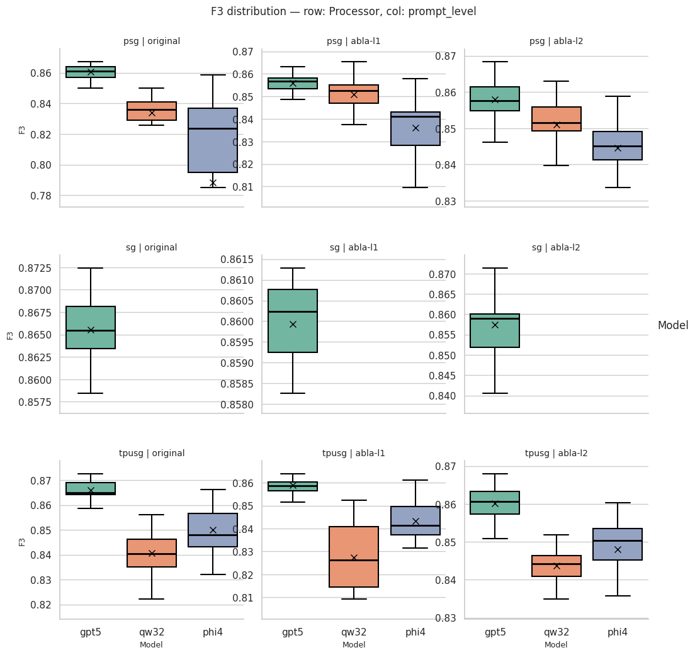
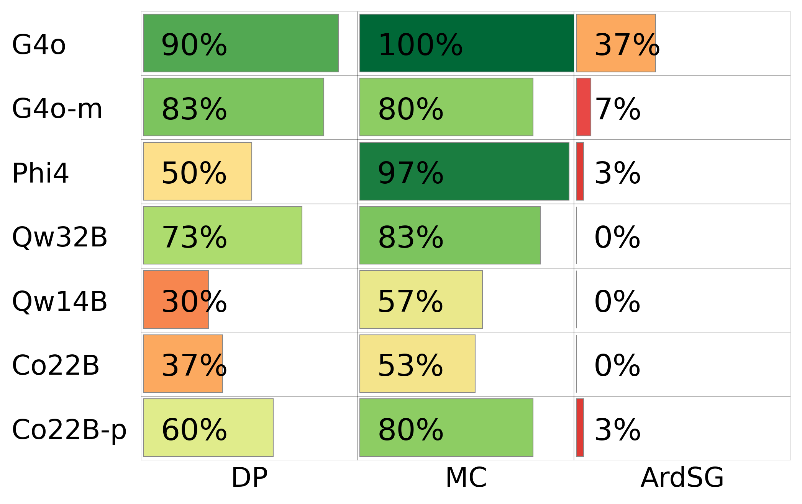
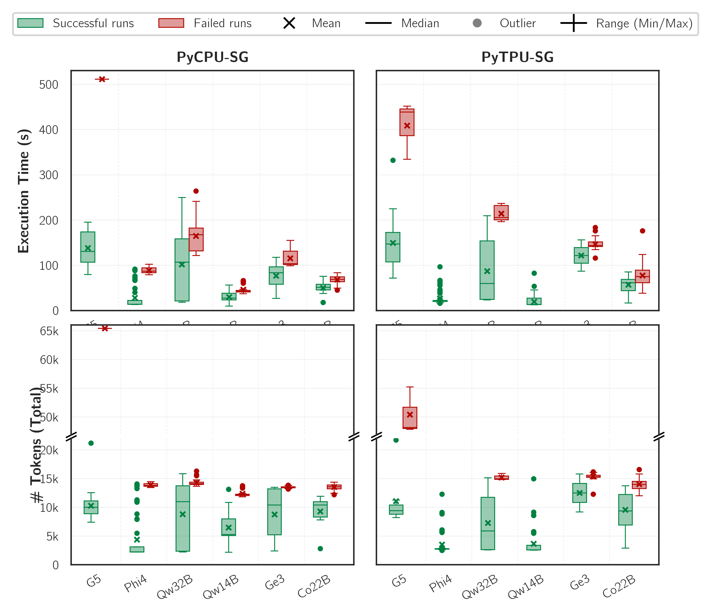
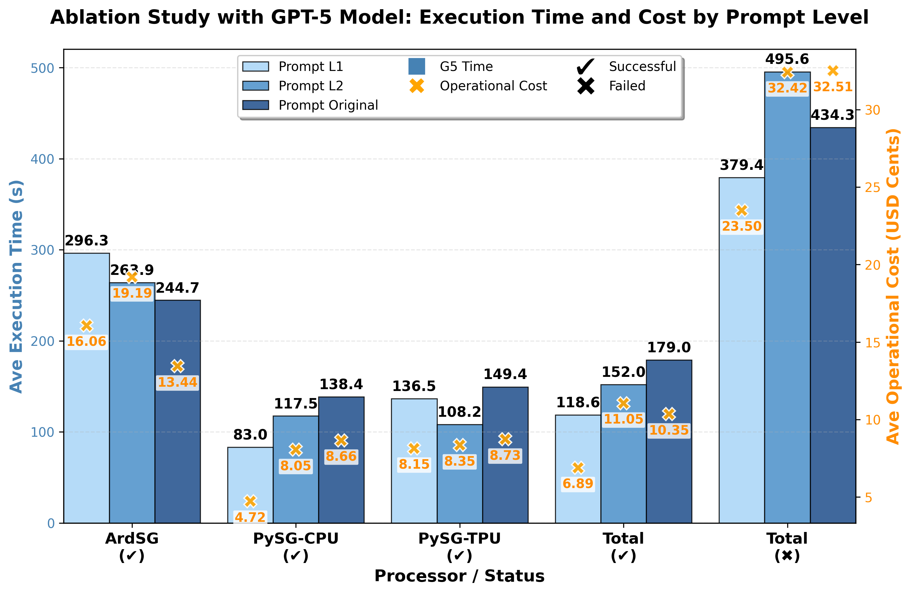

# Exported Statistics for Direct Plotting

This directory references CSV files in `/plottings/` with the statistics used to generate the plots. 

## Files

All files referenced below are located in `/plottings/` directory.

### 1. `ablation-results_statistics.csv`
**Used for:** 
- Box Plots showing distribution of model performance metrics
- Comparing model, processor, and prompt level variations (ablation study only)

For example, this F3-score distribution:

Contains comprehensive box plot statistics for Precision and Recall metrics across different models, processors, and prompt types.

**Columns:**
- `metric`: Performance metric ('Precision', 'Recall')
- `Model`: Internal model name ('gpt5', 'phi4', 'qw32')
- `prompt_level`: Prompt type identifier ('abla-l1', 'abla-l2', 'original')
- `Processor`: Processor stage ('psg', 'sg', 'tpusg')
- `count`: Number of data points
- `mean`: Average value
- `median`: Median value
- `std`: Standard deviation
- `min`: Minimum value
- `Q1`: First quartile (25th percentile)
- `Q3`: Third quartile (75th percentile)
- `max`: Maximum value
- `IQR`: Interquartile range (Q3 - Q1)
- `lower_whisker`: Lower whisker for box plot
- `upper_whisker`: Upper whisker for box plot
- `outlier_count`: Number of outliers beyond whiskers

**Usage Notes:**
- Whiskers are calculated using 1.5×IQR method
- Outliers are data points beyond the whisker boundaries
 

### 2. `success-rate_statistics_*.csv`
**Used for:** 
- Success Rate Bar Charts

 For example, this MCU success rate:

Contains success rates grouped by models, prompt types (only for ablation dataset), and processors.

**Columns:**
- `model`: Internal model name (e.g., 'gpt-5', 'phi4', 'qwen32')
- `model_label`: Display label (e.g., 'G5', 'Phi4', 'Qw32B')
- `processor`: Processor stage ('sg', 'psg', 'tpusg')
- `processor_label`: Display label ('ArdSG', 'PySG-CPU', 'PySG-TPU')
- `prompt_type`: Prompt type identifier ('abla-l1', 'abla-l2', 'original') - ONLY ABLATION
- `prompt_type_label`: Display label ('Prompt L1', 'Prompt L2', 'Prompt Original') - ONLY ABLATION
- `success_count`: Number of successful runs
- `failure_count`: Number of failed runs
- `total`: Total runs
- `success_rate`: Success rate (0-1 decimal)

### 3. `cost-time_statistics_*.csv`
**Used for:** 
- Box Plots showing distribution of execution latency and token consumption
- Comparing model, processor, and prompt level performance metrics

Like this box plot group: 

Contains comprehensive box plot statistics for latency (execution time) and total_tokens (token consumption) across different models, processors, and prompt types.

**Columns:**
- `metric`: Performance metric ('latency', 'total_tokens')
- `processor`: Processor stage ('sg', 'psg', 'tpusg')
- `processor_label`: Display label ('ArdSG', 'PySG-CPU', 'PySG-TPU')
- `model`: Internal model name ('gpt-5', 'phi4', 'qwen32')
- `model_label`: Display label ('G5', 'Phi4', 'Qw32B')
- `prompt_type`: Prompt type identifier ('abla-l1', 'abla-l2', 'original') - ONLY ABLATION
- `prompt_type_label`: Display label ('Prompt L1', 'Prompt L2', 'Prompt Original') - ONLY ABLATION
- `status`: 'success' or 'failure'
- `count`: Number of data points
- `min`: Minimum value
- `q1`: First quartile (25th percentile)
- `median`: Median value
- `q3`: Third quartile (75th percentile)
- `max`: Maximum value
- `mean`: Average value
- `iqr`: Interquartile range (q3 - q1)
- `lower_whisker`: Lower whisker for box plot
- `upper_whisker`: Upper whisker for box plot
- `n_outliers`: Number of outliers beyond whiskers

**Usage Notes:**
- This file enables reproduction of box plots for latency and token consumption
- Whiskers are calculated using 1.5×IQR method

 
### 4. `gpt-consumption_statistics_*.csv`
**Used for:** 
- Detailed GPT Model Cost and Time Analysis
- Comparing execution time and cost across processors and prompt types

 For example, this Cost-Time comparison regarding diffrent levels of prompt ablation from GPT-5:

Contains average latency and cost statistics for GPT models only, broken down by processor, prompt type, and success/failure status.

**Columns:**
- `model`: Internal model name ('gpt-5')
- `model_label`: Display label ('G5')
- `category`: Category identifier (processor names or 'Total-Success', 'Total-Failure')
- `category_label`: Display label with status (e.g., 'ArdSG✔', 'PySG-CPU✔', 'Total✖')
- `prompt_type`: Prompt type identifier ('abla-l1', 'abla-l2', 'original') - ONLY ABLATION
- `prompt_type_label`: Display label ('Prompt L1', 'Prompt L2', 'Prompt Original') - ONLY ABLATION
- `status`: 'success' or 'failure'
- `latency`: Average execution time (seconds)
- `cost_cents`: Average operational cost (USD cents, already scaled ×100)

 

 
## Notes

- **Cost values** are in **cents** (USD × 100), matching the plot labels
- **Success rates** are in decimal format (0-1), multiply by 100 for percentages
- **File naming conventions:**
  - `*_ablation.csv`: Ablation study data (includes prompt_type variations)
  - `*_MCU.csv`: MCU-specific data (no prompt_type column)
  - `*_MPU.csv`: MPU-specific data (no prompt_type column)
- **Processor abbreviations:**
  - `sg` / `ArdSG`: Arduino Single-shot Generation
  - `psg` / `PySG-CPU`: Python Single-shot Generation (CPU)
  - `tpusg` / `PySG-TPU`: Python Single-shot Generation (TPU)
- **Model abbreviations:**
  - `gpt-5` / `G5`: GPT-5
  - `phi4` / `Phi4`: Microsoft Phi-4
  - `qwen32` / `Qw32B`: Qwen 2.5 Coder 32B
- **Prompt types (ablation only):**
  - `abla-l1` / `Prompt L1`: Ablation Level 1 prompt
  - `abla-l2` / `Prompt L2`: Ablation Level 2 prompt
  - `original` / `Prompt Original`: Original baseline prompt
